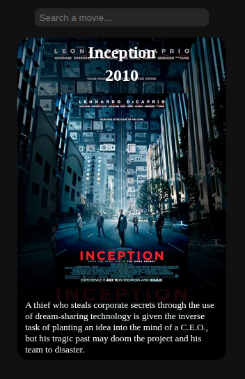
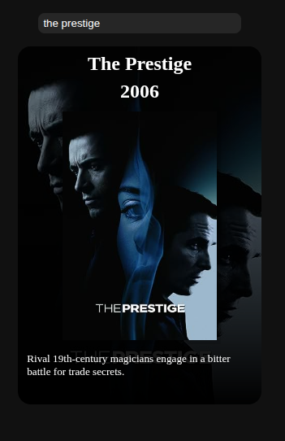
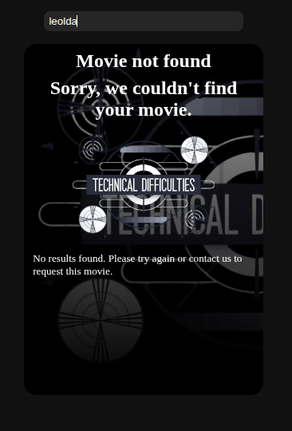
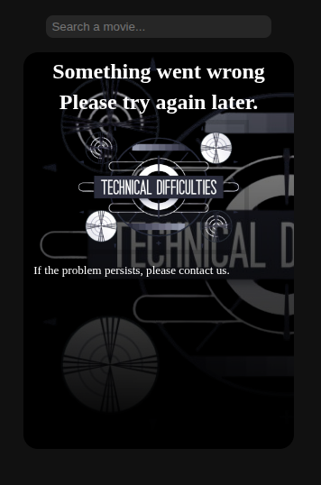

# Movie Search App

A simple web application to search for movies using the [OMDb API](http://www.omdbapi.com/).

## Features
- Search movies by title.
- Display movie poster, title, year, and description.
- Handles errors and missing posters gracefully.
- Simple and responsive layout with basic animations.

## Installation
1. Clone the repository:
```bash
git clone https://github.com/KevinU20221275/Parcial_1-DAM-FetchApi.git
```

2. Open **index.html** in your browser.

## Folder structure

```text
|-/assets
|    |- /css -> stylesheets
|    |- /js  -> JavaScript code
|    |- /img -> default images used by the app
|    |- /mocks -> mock API responses for testing
|
|- index.html
|
|-/docs
     |- /screenshots -> images for README and documentation
```

App Screenshots:

<div style="display: flex; flex-wrap: wrap; justify-content:center; gap: 20px;">

  <div style="text-align: center;">
    <h4>Default load</h4>
    
    <p>App opens with the initial movie displayed.</p>
  </div>

  <div style="text-align: center;">
    <h4>Movie Found</h4>
    
    <p>Successful search showing movie details.</p>
  </div>

  <div style="text-align: center;">
    <h4>Not Found</h4>
    
    <p>Shows placeholder when no results are found.</p>
  </div>

  <div style="text-align: center;">
    <h4>Error</h4>
    
    <p>Displayed when the API request fails.</p>
  </div>

</div>


## Notes
- The app initializes with "Inception" as the default movie.
- Press Enter in the search input to trigger a new movie search.
- Movies without posters show a default image (defaultBg.png).
- Errors or failed API requests show an error image (badMovieRes.png).